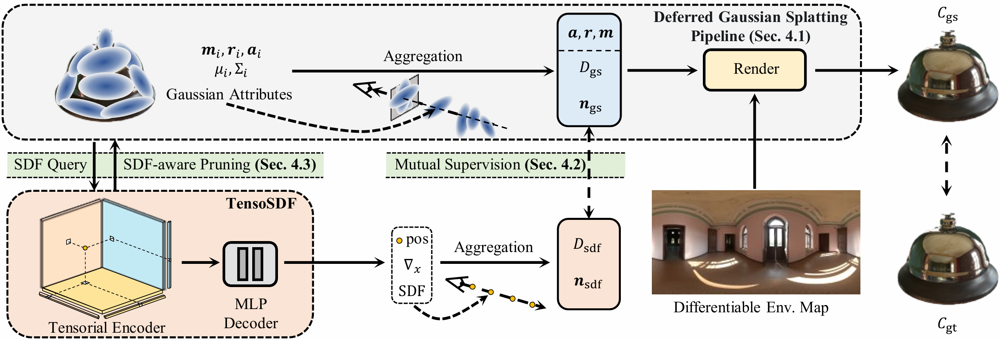

# 	GS-ROR<sup>2</sup>: Bidirectional-guided 3DGS and SDF for Reflective Object Relighting and Reconstruction


This repository contains the official implementation of the following paper:
> **GS-ROR<sup>2</sup>: Bidirectional-guided 3DGS and SDF for Reflective Object Relighting and Reconstruction**<br>
> [Zuo-Liang Zhu](https://nk-cs-zzl.github.io/)<sup>1</sup>, [Beibei Wang](https://wangningbei.github.io/)<sup>2</sup>, [Jian Yang](https://scholar.google.com/citations?user=0ooNdgUAAAAJ)<sup>1</sup><br>
> <sup>1</sup>Nankai University  <sup>2</sup>Nanjing University<br>
> In ACM TOG 2025<br>

[[Paper](https://arxiv.org/abs/2406.18544)]
[[Project Page](https://nk-cs-zzl.github.io/projects/gsror/index.html)]
[Video (TBD)]

GS-ROR<sup>2</sup> is an **efficient, robust** solution for object relighting and reconstruction, aiming to produce decent **decompositions of geometry, material, and lighting** along with **high-quality meshes** from **multi-view observations**.

<p align="middle">


</p>


## News
- **Apr. 28, 2025**: Our code is publicly available.
- **Aug. 6, 2025**: Our paper is publicly available on ArXiv.
- **Aug. 6, 2025**: Release pretrained models.


## Method Overview


For more technical details, please refer to our paper on [arXiv](https://arxiv.org/abs/2406.18544).

## Dependencies and Installation
1. Clone repo.

   ```bash
   git clone https://github.com/NK-CS-ZZL/GS-ROR.git
   cd GSROR
   ```

2. Create Conda environment and install dependencies
   ```bash
   conda create -n gsror python=3.10
   conda activate gsror
   pip install torch==2.2.1 torchvision==0.17.1 --index-url https://download.pytorch.org/whl/cu118
   pip install -r requirements.txt
   git clone https://github.com/NVlabs/nvdiffrast
   pip install ./nvdiffrast
   pip install ./submodules/fused-ssim
   pip install ./submodules/r3dg-rasterization
   pip install ./submodules/simple-knn
   ```
    **Note that** 
    + Our code is verfied under CUDA11.8 runtime, so we recommend to use the same environment to guarantee reproductibility.
    + Please switch to the corresponding runtime if the NVCC version is higher than 11.8. 

3. Download pretrained models for demos from [Download](#Download) and place them to the `pretrained` folder

## Download

<p id="Download"></p>

<table>
<thead>
  <tr>
    <th> Dataset </th>
    <th> Training Bash </th>
    <th> :link: Source </th>
    <th> :link: Checkpoint </th>
    <th> :link: Result </th>
  </tr>
</thead>
<tbody>
  <tr>
    <td>Glossy Synthetic</td>
    <th> <a href="scripts/train_scripts/train_glossy.sh">train_glossy.sh</a> </th>
    <th> <a href="https://connecthkuhk-my.sharepoint.com/personal/yuanly_connect_hku_hk/_layouts/15/onedrive.aspx?id=%2Fpersonal%2Fyuanly%5Fconnect%5Fhku%5Fhk%2FDocuments%2FNeRO&ga=1">Images</a></th>
    <th><a href="https://huggingface.co/lalala125/GSROR">HuggingFace</a></th>
    <th><a href="https://huggingface.co/lalala125/GSROR">HuggingFace</a></th>
  </tr>
  <tr>
    <td>Shiny Blender</td>
    <th> <a href="scripts/train_scripts/train_shiny.sh">train_shiny.sh</a> </th>
    <th> <a href="https://storage.googleapis.com/gresearch/refraw360/ref.zip">Images</a> / <a href="https://drive.google.com/file/d/1HGTD3uQUr8WrzRYZBagrg75_rQJmAK6S/view?usp=sharing">Point Cloud</a></th>
    <th><a href="https://huggingface.co/lalala125/GSROR">HuggingFace</a></th>
    <th><a href="https://huggingface.co/lalala125/GSROR">HuggingFace</a></th>
  </tr>
  <tr>
    <td>TensoIR Synthetic</td>
    <th> <a href="scripts/train_scripts/train_tir.sh">train_tir.sh</a> </th>
    <th> <a href="https://zenodo.org/records/7880113#.ZE68FHZBz18">Images</a> / <a href="https://drive.google.com/file/d/10WLc4zk2idf4xGb6nPL43OXTTHvAXSR3/view">Env. maps</a></th>
    <th><a href="https://huggingface.co/lalala125/GSROR">HuggingFace</a></th>
    <th><a href="https://huggingface.co/lalala125/GSROR">HuggingFace</a></th>
  </tr>

</tbody>
</table>


## Training and Evaluation

Please refer to [development.md](docs/development.md) to learn how to benchmark the DiscretizedSDF and how to train yourself DiscretizedSDF model from the scratch.


## Citation
   If you find our repo useful for your research, please consider citing our paper:

   ```bibtex
   @inproceedings{zhu_2025_gsror,
      title={GS-ROR^2: Bidirectional-guided 3DGS and SDF for Reflective Object Relighting and Reconstruction},
      author={Zhu, Zuo-Liang and Yang, Jian and Wang, Beibei},
      journal = {ACM Transactions on Graphics (TOG)},
      year={2025}，
      publisher = {ACM},
      doi={10.1145/3759248},
   }
   ```

## License
This code is licensed under the [Creative Commons Attribution-NonCommercial 4.0 International](https://creativecommons.org/licenses/by-nc/4.0/) for non-commercial use only.
Please note that any commercial use of this code requires formal permission prior to use.

## Contact

For technical questions, please contact `nkuzhuzl[AT]gmail.com`.

For commercial licensing, please contact `beibei.wang[AT]nju.edu.cn`。

## Acknowledgement

We thank [Jia Li](https://riga2.github.io/) for his suggestions during the project.

Here are some great resources we benefit from:
[GaussianShader](https://github.com/Asparagus15/GaussianShader), [NeRO](https://github.com/liuyuan-pal/NeRO), [TensoSDF](https://github.com/Riga2/TensoSDF), [Ref-NeuS](https://github.com/EnVision-Research/Ref-NeuS), [R3DG](https://github.com/NJU-3DV/Relightable3DGaussian)

**If you develop/use GS-ROR in your projects, welcome to let us know. We will list your projects in this repository.**
